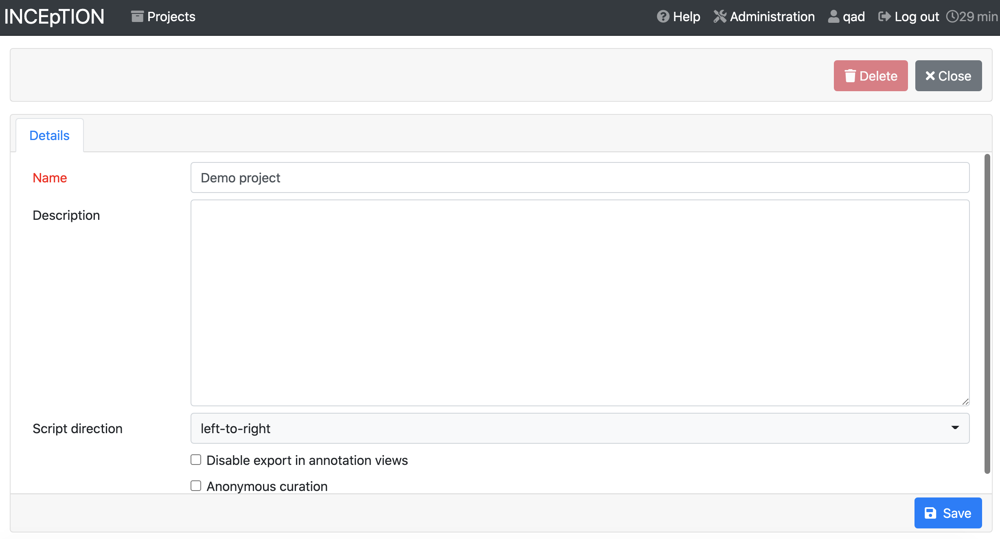
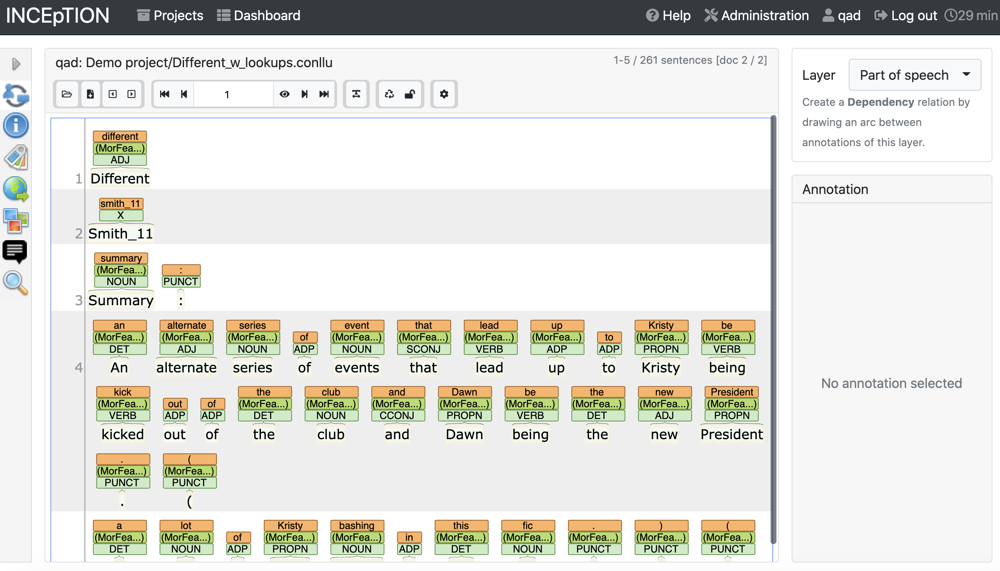
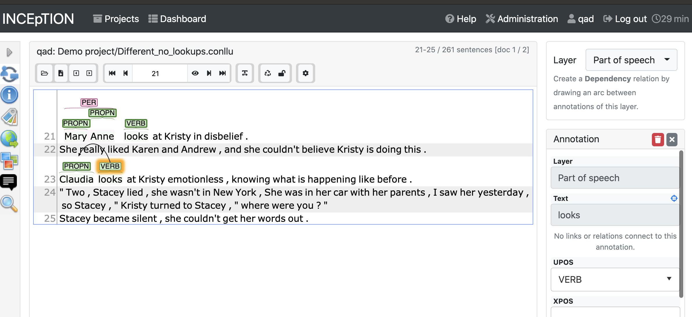
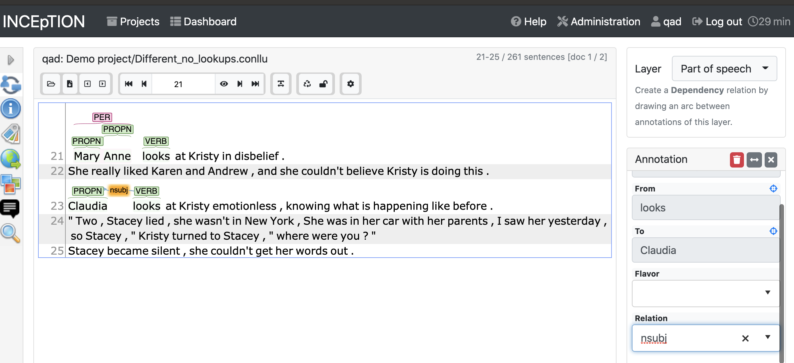

INCEpTION 
=======================

## The big picture
In order to train a model, you need annotated text. The algorithm that produces the model needs to see lots of examples of all the different kinds of annotation that you want it to be able to create for new texts. For some kinds of annotations, like part-of-speech tagging, you’ll definitely encounter lots of examples of things like nouns, verbs, and determiners in almost any text you choose. But if you want the model to be able to recognize less-common verb tenses, or classifier particles that only occur with a set of relatively rare words, you’ll need to be deliberate about choosing the texts you annotate in order to include multiple examples of those things, too. Similarly if you’re trying to annotate your texts so that your model can do named entity recognition: you may have seen models that can identify people’s names vs. place names vs. organization names with some amount of accuracy. It’s a lot easier to get a model to recognize that a word is some kind of entity; to get any accuracy in differentiating entity types, like person vs. place names, you need lots of examples of how and where both kinds of entity are used.

Realistically, you’ll end up making your best guess about what text to annotate. You’ll annotate them, train the model, and then annotate some more text based on where the model isn’t doing the right thing. And then repeat the process over again.

## This tutorial
This video/tutorial will walk you through how to annotate a text using Inception, a free, open-source, collaborative annotation environment.

We’ll cover what your text will look like when you get it out of Cadet, how to load it into Inception, how to do some of the most common types of annotation, and how to export your annotations when you’re done.

While this video/tutorial will cover the things we’ve thought of, there may be particular things you need to annotate that we won’t cover here. If you have questions or feel stuck, please reach out to the instructors! We’ll be revising these materials based on your feedback.

## Your data so far
Before bringing your data into Inception, you should have first uploaded it to Cadet. At a minimum, Cadet will create a spaCy language object using your data, and will automatically split your text into sentences and words. What you’ll have gotten out of Cadet is a file with a .conllu extension, which is a plain-text file with a special way of presenting the text. Each word (or other token, which means things like punctuation) will be on its own line, there’ll be a number of dashes, and each sentence will be separated by a space.

`3871	"	_	_	_	_	_
3872	Yes	_	_	_	_	_
3873	,	_	_	_	_	_
3874	I	_	_	_	_	_
3875	am	_	_	_	_	_
3876	,	_	_	_	_	_
3877	how	_	_	_	_	_
3878	was	_	_	_	_	_
3879	the	_	_	_	_	_
3880	job	_	_	_	_	_
3881	?	_	_	_	_	_
3882	"	_	_	_	_	_

3884	Janine	_	_	_	_	_
3885	asks	_	_	_	_	_
3886	.	_	_	_	_	_`

For other languages, Cadet may be able to do more to automate your annotation and save you some time; see videos 4-6 in the Cadet video series. If a model already exists for your language, or another dialect or variant of your language, Cadet may be able to add annotations to your corpus to the best of its ability. You can correct, delete, or enhance those annotations in Inception. Here’s those same sentences with part-of-speech annotations as well as named-entity recognition. You can see that the fourth column -- which was just dashes in the previous version -- now identifies the part of speech for that token (e.g. it correctly identifies quotation marks, commas, and question marks as punctuation, and ‘yes’ as an interjection). The fifth column is also filled in for line 3884, identifying ‘Janine’ as a person entity.

`3871	"	"	PUNCT	_	_	_
3872	Yes	yes	INTJ	_	_	_
3873	,	,	PUNCT	_	_	_
3874	I	I	PRON	_	_	_
3875	am	be	AUX	_	_	_
3876	,	,	PUNCT	_	_	_
3877	how	how	ADV	_	_	_
3878	was	be	AUX	_	_	_
3879	the	the	DET	_	_	_
3880	job	job	NOUN	_	_	_
3881	?	?	PUNCT	_	_	_
3882	"	"	PUNCT	_	_	_

3884	Janine	Janine	PROPN	PERSON	_	_
3885	asks	ask	VERB	_	_	_
3886	.	.	PUNCT	_	_	_`

## Welcome to Inception
The first step is to log into the [Inception instance set up for the institute](https://inception.slovo.world/login.html).

Once you’ve logged in, you’ll go to the Projects page, where you can see all the projects you have access to and create new ones.

Click on the blue “Create new project” button.

## Creating a new project
Give your project a name, and write a brief description if you’d like.

If your language uses a right-to-left script, use the drop-down for script direction to indicate that.

Hit the save button to move on to the next page of settings. These are the same options you’ll see when you go into the “Settings” area of your project’s configuration page later, so you can easily change things if needed.

### Documents
Choose the “Documents” tab. Click the file-folder icon to browse your computer for the .conll file that you downloaded from Inception, and select “CoNLL-U” as the file format. Then click “Import”.

You should see the file appear in the list of files in the “Documents” tab.

### Users
Under the “Users” tab, you can add the annotators who will be working on your project with you. If you want to add an existing user to your project (e.g. Institute instructors), you can choose them from the dropdown. If you need to create a new user account, contact an Institute instructor; you need superuser permissions to create a new user.

By default, any user you add just has the role of “annotator”. If you click on their name, you can add additional roles like “Manager” (manages the whole project) or “Curator” (can compare and reconcile different people’s annotations).

### Layers
Layers are different kinds of annotation. When you’re annotating text, you have to specify what layer each annotation belongs to. You can create custom layers, but the built-in options should cover a lot of what you need.

All annotations are of the type *span*, *relation*, or *chain*.

#### Spans
Spans let you select one or more tokens next to each other. You use span annotations for part-of-speech tagging (you select each word and label it), named entity tagging (you may need to choose more than one word, like a person’s first and last names). 

#### Relations
Relations allow you to connect tokens. The dependency layer uses relations, for instance, to connect text that’s been labeled with part-of-speech annotations. Things like connecting a verb with the subject performing that action.

#### Chains
Chains define relationships between multiple things at the same time. The most common example of a chain is coreference resolution, where you want to connect all the words and pronouns and names that refer to the same person.

#### Key bindings
Once you start doing a lot of annotation, you may want to set up keyboard shortcuts, or "key bindings", so you don't have to select annotation values using the drop-downs. For detailed documentation, including which key combinations are permissible, see the [Inception documentation](https://inception.apjan.co/doc/user-guide.html#_key_bindings).

To set up a key binding, choose a layer, then choose a feature in the upper right corner. If you scroll down through the feature details, at the bottom right you’ll see key bindings, where you can map a particular label to a particular key combination.

### Tagsets
To make your model maximally compatible with other models, it’s ideal if you can use standard sets of tags (like Universal Dependency tags for part-of-speech and dependency relations). Depending on what you want to do with your model, you may need to add custom tagsets, e.g. formal vs. informal vs. nickname form of names. If you want to add new values to an existing tagset, click on the name of the tagset and then hit the blue “Create” button above the list of tags. If you create an entirely new tagset, you’ll need to make sure you connect it to one of your layers back in the Layers tab.

When you’re done setting up your new project, click the gray “Close” button in the upper right.

## Projet dashboard
On the projects page you see when you’ve logged into Inception, clicking on a project will take you to the project dashboard.

## Annotation
When you click the “Annotation” icon, as an administrator on your project, you’ll get to choose which user you’re annotating the text as, and which text file you’re annotating.

If you already used Cadet to automatically annotate your text, you’ll see those annotations when you load the annotation screen. The annotation screen shows five sentences at a time, by default.

If Cadet didn’t do any automatic annotation, you’ll see the sentences are split into lines, and nothing more.

### Layer selection
In the column on the right, choose a layer. For this example, we’ll start with part-of-speech

### Annotating single/multiple tokens

For layers that require you to work with a single token at a time (like part-of-speech), double-click a single token. The right column will display the layer you’re working with and text you’ve selected. You can use the dropdown for UPOS (universal part-of-speech) to select the right part-of-speech tag. Once you’ve selected the tag, it will appear above the token you’ve selected. If you need to delete it, click on the tag above the text and hit the red “Delete” button in the right column. 

Some layers, like named entity recognition, allow you to select multiple adjacent tokens. For those layers, you can highlight the texts that should be annotated.

### Dependencies
The dependency layer isn’t selectable, but you can add dependency annotations from the part-of-speech layer. Click on one token, and drag it onto the other token you want to connect it with. The right sidebar will be populated with the source (“from”) and the target (“to”), and you can choose a label using the “Relation” dropdown. Buttons at the top allow you to reverse the “from” and “to” values.

Dragging the verb label onto the proper noun label

Dependency established, now you need to add a tag.

Adding the relation tag to the dependency in the right-hand column.

### Wrapping up annotation
When you’re done with annotating a text and ready for the next step, hit the lock icon in the toolbar above the sentences. You’ll see a warning pop up; hit the “Confirm” button.

## Agreement
Inception provides an easy way to compare how often annotators are doing the same thing. This can be useful to monitor as a way to check in on your annotators, and identify any issues related to how to mark things up that you should discuss in a team meeting.

On the page for your project, click “Agreement”, then choose a feature, like POS. Cohen’s Kappa works as a default measure.

You’ll see how many “positions” (or tokens) pairs of annotators have both done, as well as the percent of agreement:

Here you can see that the user accounts qad and qad2 have annotated 21 of the same “positions” and agree 94% of the time.

## Curation
In Inception, curation is the process of reconciling differences in the annotation, and pulling together annotation chunks from different annotators. Each sentence in a document is given a number in the left-hand column. 

Click on a number to view the annotations, and choose which layer you want to look at from the column on the right.

The view on the top is Inception’s attempt to reconcile the annotations from the various annotators. If you click on an annotation from an individual annotator, it will add that annotation to the final version on top.

In this example, we see in blue a number of annotations that were not included in the final version, either because there was a conflict between annotators (e.g. PROPN vs PRON for “She”) or because one annotator omitted them (e.g. the punctuation). Clicking on those labels will add them to the final version. If they were originally omitted because of a conflict between annotators, the annotation you selected will turn green, and the alternate/incorrect annotation will turn red. 

## Export
When your data is ready to export for model training, go back to the Settings interface, and choose “Export”. You can select a format (we recommend CoNLL-U), then click the “Export the whole project” button. A zip file will automatically download once it is ready.

